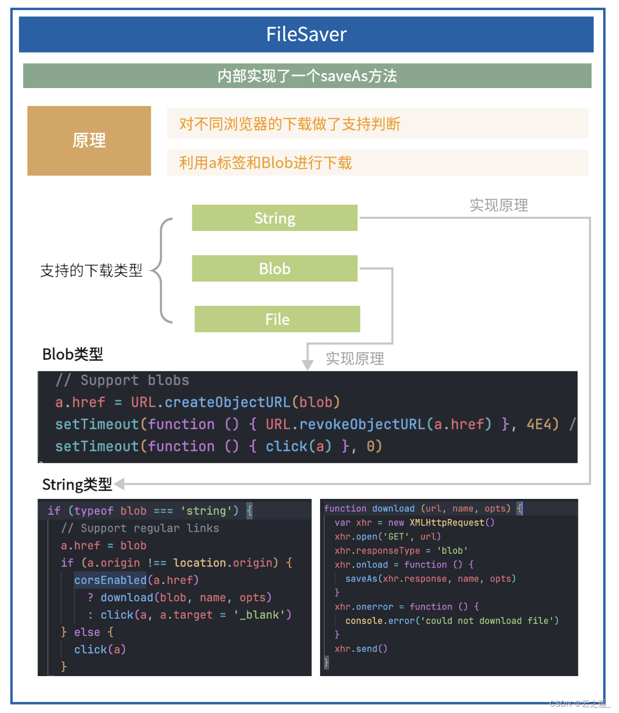

## a 标签下载

同时适用于 word,ppt 等浏览器不会默认执行预览的文档,也可以用于下载后端接口返回的流数据

> 适合场景

- get 请求
- 返回为文件流 / 返回 URL

> 不适合场景

- 下载需要计算、权限验证、携带 Cookie
- 需要动态生成文件内容，即需要 Post 传参
- 需要处理跨域问题
- 需要处理大文件下载（10M 以上）
- 需要断点续传或文件下载进度监控等

> 下载一个 excel 文档

```js
//下载一个链接 - pc
function download(link, name) {
  if (!name) {
    name = link.slice(link.lastIndexOf('/') + 1)
  }
  let eleLink = document.createElement('a')
  eleLink.download = name
  eleLink.style.display = 'none'
  eleLink.href = link
  document.body.appendChild(eleLink)
  eleLink.click()
  document.body.removeChild(eleLink)
}
//下载excel
download('http://111.229.14.189/file/1.xlsx')
```

### 响应头 Content-Disposition

> Content-Disposition 是一个 HTTP 响应头，它指定了如何显示响应的内容，特别是对于以附件形式下载的文件。这个头部可以包含一个内联展示（inline）的选项，也可以包含一个附件（attachment）的选项，以及可选的文件名参数。

- 1.内联展示（inline）
  > 如果 Content-Disposition 头部的值设置为 inline，浏览器通常会尝试在浏览器窗口内显示内容，例如在浏览器中直接打开 PDF 文件或图像。这对于一些直接浏览的文件类型是合适的。
- 2.附件下载（attachment）
  > 如果 Content-Disposition 头部的值设置为 attachment，浏览器通常会提示用户下载文件，而不是直接在浏览器中显示。这对于需要用户保存到本地的文件，如文档、图像、音频和视频等，是常见的设置。
- 3.指定文件名
  > 通过 filename 参数，可以指定下载文件的文件名。这对于确保用户下载的文件有一个明确的名称非常有用，而不是使用服务器上的默认文件名。


## form 表单提交

```js
// 下载 - h5
function downloadFile(fileUrl) {
  let url = unit.getUploadUrl(fileUrl)
  const form = document.createElement('form')
  form.target = '_blank'
  form.action = url
  document.getElementsByTagName('body')[0].appendChild(form)
  form.submit()
  document.getElementsByTagName('body')[0].removeChild(form)
}
```

## 在浏览器中自定义下载一些内容

场景：我想下载一些 DOM 内容，我想下载一个 JSON 文件

```js
/**
 * 浏览器下载静态文件
 * @param {String} name 文件名
 * @param {String} content 文件内容
 */
function downloadFile(name, content) {
  if (typeof name == 'undefined') {
    throw new Error('The first parameter name is a must')
  }
  if (typeof content == 'undefined') {
    throw new Error('The second parameter content is a must')
  }
  if (!(content instanceof Blob)) {
    content = new Blob([content])
  }
  const link = URL.createObjectURL(content)
  download(link, name)
}
//使用方式：

downloadFile('1.txt', 'lalalallalalla')
downloadFile('1.json', JSON.stringify({ name: 'hahahha' }))
```

## 下载后端返回的流

> 适合场景

- 接口返回的格式为文件流格式
- 下载需要计算、权限验证、携带 Cookie
- 需要动态生成文件内容，即需要 Post 传参

数据是后端以接口的形式返回的,调用`1`中的 download 方法进行下载

```js
function fileDownLoad(data) {
  // 1. 创建点击下载的元素
  var linkElement = document.createElement('a')

  // 2. 判断浏览器是否支持blob对象
  try {
    //该实例化的方式第一个参数必须是数组的格式
    var blob = new Blob([data], {
      type: 'application/pdf'
    })
  } catch (e) {
    //旧版本浏览器下的blob创建对象
    window.BlobBuilder =
      window.BlobBuilder ||
      window.WebKitBlobBuilder ||
      window.MozBlobBuilder ||
      window.MSBlobBuilder
    if (e.name == 'TypeError' && window.BlobBuilder) {
      var blobbuilder = new BlobBuilder()
      BlobBuilder.append(data)
      var blob = blobbuilder.getBlob('application/pdf')
    } else {
      alert('浏览器版本较低，暂不支持该文件类型下载')
    }
  }

  // 提取blob文件中的url信息，使二进制文件在不读取到js中时直接下载
  let url = window.URL.createObjectURL(blob)
  linkElement.setAttribute('href', url)
  linkElement.setAttribute('downLoad', 'download')
  linkElement.click()

  // 释放URL内存
  window.URL.revokeObjectURL(url)
}

document.querySelector('#fileInput').addEventListener('change', event => {
  fileDownLoad(event.target.files[0])
})
```

### 下载接口需要携带 Cookie 信息

```js
function downloadFileWithToken(url, token) {
  let xhr = new XMLHttpRequest()
  xhr.open('GET', url, true)
  xhr.setRequestHeader('Authorization', token)
  xhr.responseType = 'blob'
  xhr.onload = function (e) {
    if (this.status === 200) {
      let blob = this.response
      let fileName = '下载的文件名称'
      // 针对IE浏览器
      if (window.navigator.msSaveBlob) {
        try {
          window.navigator.msSaveBlob(blob, fileName)
        } catch (e) {
          console.log(e)
        }
      } else {
        // 通用浏览器
        const url = window.URL.createObjectURL(blob)
        a.href = url
        a.download = fileName
        document.body.appendChild(a)
        a.click()
        document.body.removeChild(a)
        window.URL.revokeObjectURL(url)
      }
    } else {
      alert('下载文件失败')
    }
  }
  xhr.send()
}
```

### 提供一个图片链接，点击下载

图片、pdf 等文件，浏览器会默认执行预览，不能调用 download 方法进行下载，需要先把图片、pdf 等文件转成 blob，再调用 download 方法进行下载，转换的方式是使用 axios 请求对应的链接

```js
//可以用来下载浏览器会默认预览的文件类型，例如mp4,jpg等
import axios from 'axios'
//提供一个link，完成文件下载，link可以是  http://xxx.com/xxx.xls
function downloadByLink(link, fileName) {
  axios
    .request({
      url: link,
      responseType: 'blob' //关键代码，让axios把响应改成blob
    })
    .then(res => {
      const link = URL.createObjectURL(res.data)
      download(link, fileName)
    })
}
```

注意：会有同源策略的限制，需要配置转发

## FileSaver 实现

> [FileSaver.js 是一个用于在客户端保存文件的 JavaScript 库](https://github.com/eligrey/FileSaver.js#readme)

### 基础使用

```js
import FileSaver from 'file-saver'

let blob = new Blob(['Hello, FileSaver! Blob 下载'], {
  type: 'text/plain;charset=utf-8'
})
window.saveAs(blob, 'hello FileSaver.txt')
//or

let blob = new Blob(['Hello, FileSaver! URL 下载'], {
  type: 'text/plain;charset=utf-8'
})
const url = window.URL.createObjectURL(blob)
window.saveAs(url, 'hello FileSaver.txt')
// 保存canvas画布内容
let canvas = document.getElementById('my-canvas')
canvas.toBlob(function (blob) {
  saveAs(blob, 'abao.png')
})
// 下载
function download() {
  if (!imgDataUrl) {
    alert('请先合成图片')
    return
  }
  const imgBlob = dataUrlToBlob(imgDataUrl, 'image/png')
  saveAs(imgBlob, 'face.png')
}
```

[](https://img-blog.csdnimg.cn/direct/ebb24d3a9a8f43fda07a31b784f78a17.png#pic_center)

## showSaveFilePicker API 下载

> showSaveFilePicker API 是 Window 接口中定义的方法，调用该方法后会显示允许用户选择保存路径的文件选择器

```js
async function saveFile(blob, filename) {
  try {
    const handle = await window.showSaveFilePicker({
      suggestedName: filename,
      types: [
        {
          description: 'PNG file',
          accept: {
            'image/png': ['.png']
          }
        },
        {
          description: 'Jpeg file',
          accept: {
            'image/jpeg': ['.jpeg']
          }
        }
      ]
    })
    const writable = await handle.createWritable()
    await writable.write(blob)
    await writable.close()
    return handle
  } catch (err) {
    console.error(err.name, err.message)
  }
}
function download() {
  if (!imgDataUrl) {
    alert('请先合成图片')
    return
  }
  const imgBlob = dataUrlToBlob(imgDataUrl, 'image/png')
  saveFile(imgBlob, 'face.png')
}
```

当你使用以上更新后的 saveFile 函数，来保存已合成的图片时，会显示以下保存文件选择器：

由上图可知，相比 a 标签下载 的方式，showSaveFilePicker API 允许你选择文件的下载目录、选择文件的保存格式和更改存储的文件名称。看到这里是不是觉得 showSaveFilePicker API 功能挺强大的，不过可惜的是该 API 目前的兼容性还不是很好，具体如下图所示：


如果你想在实际项目中使用这些 API 的话，可以考虑使用 GoogleChromeLabs 开源的 browser-fs-access 这个库，该库可以让你在支持平台上更方便地使用 File System Access API，对于不支持的平台会自动降级使用 和 的方式。

### 安装

```js
npm install --save browser-fs-access
```

### 示例

```js
// 导入的方法将使用文件系统
// 访问API或回退实现。
import {
  fileOpen,
  directoryOpen,
  fileSave,
  supported
} from 'https://unpkg.com/browser-fs-access'
;(async () => {
  if (supported) {
    console.log('Using the File System Access API.')
  } else {
    console.log('Using the fallback implementation.')
  }

  // 打开一个文件。
  const blob = await fileOpen({
    mimeTypes: ['image/*']
  })

  // 打开多个文件。
  const blobs = await fileOpen({
    mimeTypes: ['image/*'],
    multiple: true
  })

  // 打开不同MIME类型的文件。
  const blobs = await fileOpen([
    {
      description: 'Image files',
      mimeTypes: ['image/jpg', 'image/png', 'image/gif', 'image/webp'],
      extensions: ['.jpg', '.jpeg', '.png', '.gif', '.webp'],
      multiple: true
    },
    {
      description: 'Text files',
      mimeTypes: ['text/*'],
      extensions: ['.txt']
    }
  ])

  // 打开目录中的所有文件，
  // 递归地包括子目录。
  const blobsInDirectory = await directoryOpen({
    recursive: true
  })

  // 保存一个文件
  await fileSave(blob, {
    fileName: 'Untitled.png',
    extensions: ['.png']
  })

  // 保存将流式传输的“响应”。
  const response = await fetch('foo.png')
  await fileSave(response, {
    fileName: 'foo.png',
    extensions: ['.png']
  })

  // 保存将流式传输的“Promise<Blob>”。
  // 无需“等待”要创建的“Blob”。
  const blob = createBlobAsyncWhichMightTakeLonger(someData)
  await fileSave(response, {
    fileName: 'Untitled.png',
    extensions: ['.png']
  })
})()
```

### 常用 api

- 打开文件

```js
// Options are optional. You can pass an array of options, too.
const options = {
  // List of allowed MIME types, defaults to `*/*`.
  mimeTypes: ['image/*'],
  // List of allowed file extensions (with leading '.'), defaults to `''`.
  extensions: ['.png', '.jpg', '.jpeg', '.webp'],
  // Set to `true` for allowing multiple files, defaults to `false`.
  multiple: true,
  // Textual description for file dialog , defaults to `''`.
  description: 'Image files',
  // Suggested directory in which the file picker opens. A well-known directory, or a file or directory handle.
  startIn: 'downloads',
  // By specifying an ID, the user agent can remember different directories for different IDs.
  id: 'projects',
  // Include an option to not apply any filter in the file picker, defaults to `false`.
  excludeAcceptAllOption: true
}

const blobs = await fileOpen(options)
```

- 打开目录

```js
// Options are optional.
const options = {
  // Set to `true` to recursively open files in all subdirectories,
  // defaults to `false`.
  recursive: true,
  // Suggested directory in which the file picker opens. A well-known directory, or a file or directory handle.
  startIn: 'downloads',
  // By specifying an ID, the user agent can remember different directories for different IDs.
  id: 'projects',
  // Callback to determine whether a directory should be entered, return `true` to skip.
  skipDirectory: entry => entry.name[0] === '.'
}

const blobs = await directoryOpen(options)
```

- 保存文件

```js
// Options are optional. You can pass an array of options, too.
const options = {
  // Suggested file name to use, defaults to `''`.
  fileName: 'Untitled.txt',
  // Suggested file extensions (with leading '.'), defaults to `''`.
  extensions: ['.txt'],
  // Suggested directory in which the file picker opens. A well-known directory, or a file or directory handle.
  startIn: 'downloads',
  // By specifying an ID, the user agent can remember different directories for different IDs.
  id: 'projects',
  // Include an option to not apply any filter in the file picker, defaults to `false`.
  excludeAcceptAllOption: true
}

// Optional file handle to save back to an existing file.
// This will only work with the File System Access API.
// Get a `FileHandle` from the `handle` property of the `Blob`
// you receive from `fileOpen()` (this is non-standard).
const existingHandle = previouslyOpenedBlob.handle

// Optional flag to determine whether to throw (rather than open a new file
// save dialog) when `existingHandle` is no longer good, for example, because
// the underlying file was deleted. Defaults to `false`.
const throwIfExistingHandleNotGood = true

// `blobOrPromiseBlobOrResponse` is a `Blob`, a `Promise<Blob>`, or a `Response`.
await fileSave(
  blobOrResponseOrPromiseBlob,
  options,
  existingHandle,
  throwIfExistingHandleNotGood
)
```

## zip 下载

> 把 多张 张素材图，打包成 Zip 文件并下载到本地

```html
<h3>Zip 下载示例</h3>
 
<div>
           
     
</div>
  <button onclick="download()">打包下载</button> 
```

```js
const images = ['body.png', 'eyes.png', 'mouth.png']
const imageUrls = images.map(name => '../images/' + name)
async function download() {
  let zip = new JSZip()
  Promise.all(imageUrls.map(getFileContent)).then(contents => {
    contents.forEach((content, i) => {
      zip.file(images[i], content)
    })
    zip.generateAsync({ type: 'blob' }).then(function (blob) {
      saveAs(blob, 'material.zip')
    })
  })
}
// 从指定的url上下载文件内容
function getFileContent(fileUrl) {
  return new JSZip.external.Promise(function (resolve, reject) {
    // 调用jszip-utils库提供的getBinaryContent方法获取文件内容
    JSZipUtils.getBinaryContent(fileUrl, function (err, data) {
      if (err) {
        reject(err)
      } else {
        resolve(data)
      }
    })
  })
}
```

## 大文件分块下载

```js
//download
function concatenate(arrays) {
  if (!arrays.length) return null
  let totalLength = arrays.reduce((acc, value) => acc + value.length, 0)
  let result = new Uint8Array(totalLength)
  let length = 0
  for (let array of arrays) {
    result.set(array, length)
    length += array.length
  }
  return result
}

function getContentLength(url) {
  return new Promise((resolve, reject) => {
    let xhr = new XMLHttpRequest()
    xhr.open('HEAD', url)
    xhr.send()
    xhr.onload = function () {
      resolve(
        // xhr.getResponseHeader("Accept-Ranges") === "bytes" &&
        ~~xhr.getResponseHeader('Content-Length')
      )
    }
    xhr.onerror = reject
  })
}

function getBinaryContent(url, start, end, i) {
  return new Promise((resolve, reject) => {
    try {
      let xhr = new XMLHttpRequest()
      xhr.open('GET', url, true)
      xhr.setRequestHeader('range', `bytes=${start}-${end}`) // 请求头上设置范围请求信息
      xhr.responseType = 'arraybuffer' // 设置返回的类型为arraybuffer
      xhr.onload = function () {
        resolve({
          index: i, // 文件块的索引
          buffer: xhr.response // 范围请求对应的数据
        })
      }
      xhr.send()
    } catch (err) {
      reject(new Error(err))
    }
  })
}

function saveAs({ name, buffers, mime = 'application/octet-stream' }) {
  const blob = new Blob([buffers], { type: mime })
  const blobUrl = URL.createObjectURL(blob)
  const a = document.createElement('a')
  a.download = name || Math.random()
  a.href = blobUrl
  a.click()
  URL.revokeObjectURL(blob)
}

async function asyncPool(poolLimit, array, iteratorFn) {
  const ret = [] // 存储所有的异步任务
  const executing = [] // 存储正在执行的异步任务
  for (const item of array) {
    // 调用iteratorFn函数创建异步任务
    const p = Promise.resolve().then(() => iteratorFn(item, array))
    ret.push(p) // 保存新的异步任务

    // 当poolLimit值小于或等于总任务个数时，进行并发控制
    if (poolLimit <= array.length) {
      // 当任务完成后，从正在执行的任务数组中移除已完成的任务
      const e = p.then(() => executing.splice(executing.indexOf(e), 1))
      executing.push(e) // 保存正在执行的异步任务
      if (executing.length >= poolLimit) {
        await Promise.race(executing) // 等待较快的任务执行完成
      }
    }
  }
  return Promise.all(ret)
}

async function download({ url, chunkSize, poolLimit = 1 }) {
  const contentLength = await getContentLength(url)
  const chunks =
    typeof chunkSize === 'number' ? Math.ceil(contentLength / chunkSize) : 1
  const results = await asyncPool(
    poolLimit,
    [...new Array(chunks).keys()],
    i => {
      let start = i * chunkSize
      let end = i + 1 == chunks ? contentLength - 1 : (i + 1) * chunkSize - 1
      return getBinaryContent(url, start, end, i)
    }
  )
  const sortedBuffers = results.map(item => new Uint8Array(item.buffer))
  return concatenate(sortedBuffers)
}
```

```html
<!DOCTYPE html>
<html lang="zh-cn">
  <head>
    <meta charset="UTF-8" />
    <meta http-equiv="X-UA-Compatible" content="IE=edge" />
    <meta name="viewport" content="width=device-width, initial-scale=1.0" />
    <title>大文件分块下载示例</title>
    <script src="./download.js"></script>
  </head>
  <body>
    <div>
      <h3>大文件分块下载示例</h3>
      
    </div>
    <button onclick="chunkDownload()">下载</button>
    <script>
      const fileUrl = 'http://localhost:3000/big-file/books.png'
      function chunkDownload() {
        console.log('大文件下载开始: ' + +new Date())
        download({
          url: fileUrl,
          chunkSize: 0.1 * 1024 * 1024,
          poolLimit: 6
        }).then(buffers => {
          console.log('大文件下载结束: ' + +new Date())
          saveAs({ buffers, name: 'books.png', mime: 'image/png' })
        })
      }
    </script>
  </body>
</html>
```
